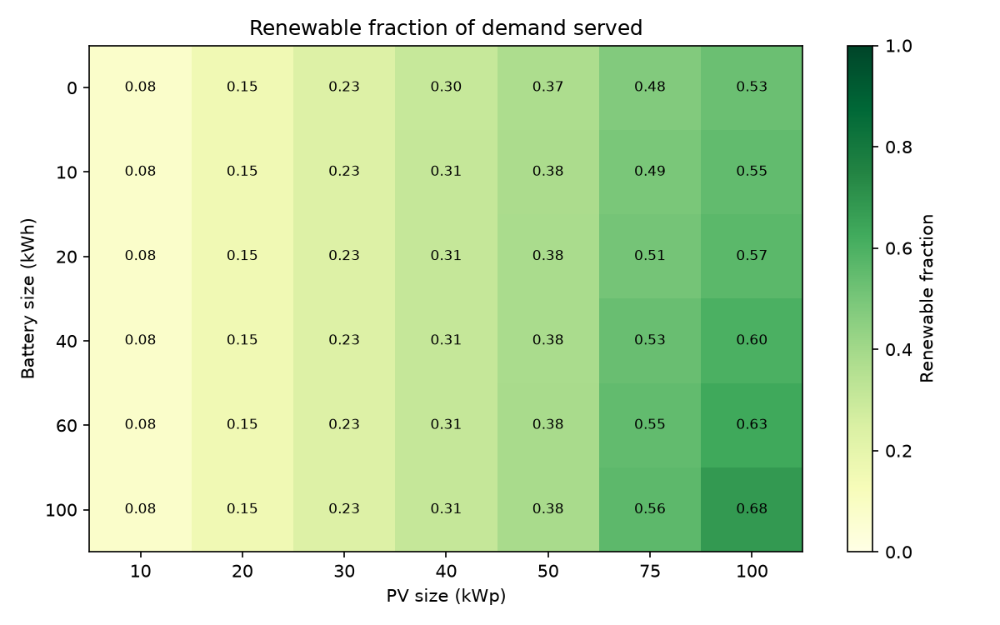
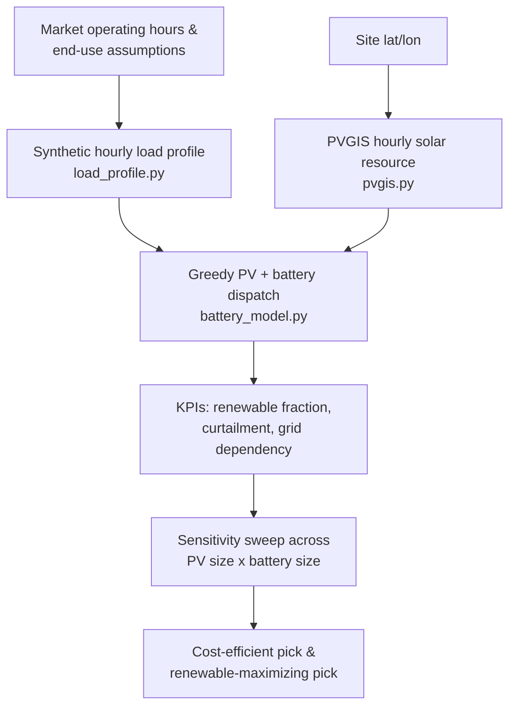
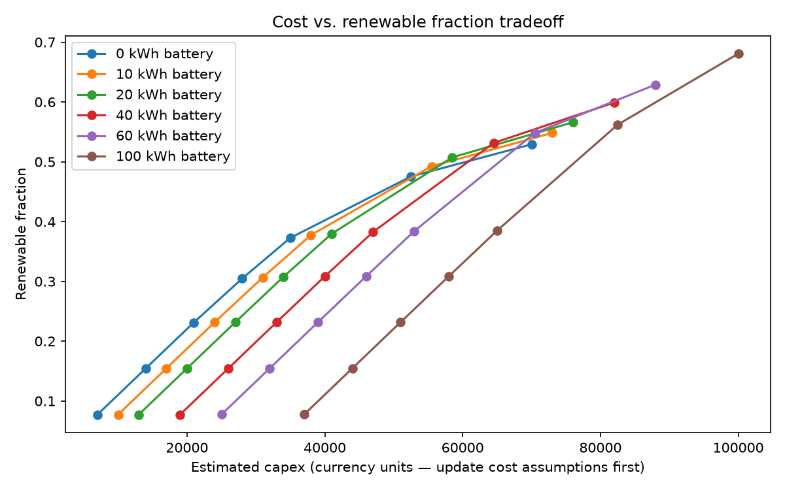

# SolarMarket-Sizer: PV + Battery Sizing & Sensitivity Analysis for an Urban Market

A techno-economic sizing tool that estimates the optimal rooftop PV +
battery system for an off-grid or grid-unreliable urban market, using an
hourly greedy dispatch simulation and a sensitivity sweep across candidate
system sizes. The tool takes a synthetic end-use load profile and real
solar-resource data (PVGIS) as inputs, simulates hour-by-hour how a given
PV + battery combination would serve that load over a full year, and sweeps
across many combinations to surface the renewable-fraction / cost tradeoff
— rather than outputting a single "optimal" size.

**Motivation:** Many urban markets in grid-constrained regions face
unreliable or expensive grid electricity, and operators considering solar
+ storage rarely have access to metered demand data or a rigorous sizing
methodology, most decisions default to rules of thumb. This project asks:
*starting only from explicit, statable assumptions about market operating
hours and end-use loads, and from public solar-resource data, can a simple
transparent dispatch model produce a defensible PV + battery sizing
recommendation — and make the underlying cost/renewable-fraction tradeoff
visible, rather than hiding it behind a single number?*

> **How to read the results in this repo:** every number here (renewable
> fraction, capex, payback framing) is a function of the assumptions set
> in the notebook's Section 1 (market load assumptions) and the placeholder
> `pv_cost_per_kwp` / `battery_cost_per_kwh` figures. It is not a measured
> or audited quantity. See [Limitations](#limitations--honest-caveats)
> before citing any figure from this repo elsewhere.



## Research Contribution

This project demonstrates a transparent, assumption-driven PV + battery
sizing methodology for demand profiles where no metered data exists — a
common situation for small/medium commercial loads (markets, clinics,
schools) in grid-constrained regions. Rather than optimizing a single
objective, it presents the renewable-fraction-vs-cost tradeoff directly
and lets the two ends of that tradeoff (a cost-efficient pick and a
renewable-maximizing pick) both be reported as valid answers, since the
"correct" choice depends on constraints (budget vs. resilience) outside
the model's scope. The dispatch and sweep logic is domain-general and
applies to any similarly-shaped commercial daytime load.

## Background & Motivation

This project sits at the intersection of energy systems engineering and
applied data analysis, applied to distributed solar + storage sizing for
commercial loads in emerging urban energy markets. Sizing PV and battery
capacity correctly is a first-order driver of both project economics and
service reliability: undersizing leaves demand unmet, oversizing wastes
capital on curtailed generation and underused battery capacity. Getting
this right without expensive site-specific optimization software, using
only public data and explicit assumptions, is the practical problem this
project addresses.

## Methodology



The pipeline has three stages:

### 1. Synthetic hourly load profile (`src/load_profile.py`)

[#1-synthetic-hourly-load-profile-srcload_profilepy](#1-synthetic-hourly-load-profile-srcload_profilepy)

Hourly demand is built from explicit end-use assumptions (number of
stalls, per-stall load, lighting, refrigeration, water pumping, security,
other fixed loads) rather than a single assumed peak-load figure, over the
market's stated operating hours and market days. Low/base/high demand
scenarios (80% / 100% / 120% of the base assumptions) are generated via
`apply_demand_scenario()` and used two ways downstream: the **base**
scenario drives the main PV/battery sweep (Sections 5–7 of the notebook),
and all three scenarios are swept together in Section 8 to stress-test the
final sizing recommendation against demand uncertainty.

> **Why synthetic data?** No public dataset of real, metered urban-market
> electricity demand exists at hourly granularity for most sites. The
> profile is intentionally built from named, adjustable assumptions
> (`NUM_STALLS`, `STALL_LOAD_KW`, etc. in the notebook) rather than
> presented as measured data, so anyone reviewing the results can see
> exactly what demand figure they're built on and substitute their own.

### 2. Solar resource data (`src/pvgis.py`)

[#2-solar-resource-data-srcpvgispy](#2-solar-resource-data-srcpvgispy)

Hourly PV generation for a 1 kWp reference system is pulled from the
European Commission's **PVGIS** `seriescalc` API (free, no key required),
built from satellite-derived irradiance data. A `load_pvgis_csv()` path is
also provided for offline use with a manually downloaded CSV, since the
live API requires network access to `re.jrc.ec.europa.eu`. Output is
scaled linearly to any target PV system size via `scale_pv_output()`.

### 3. Dispatch simulation & sensitivity sweep (`src/battery_model.py`)

[#3-dispatch-simulation--sensitivity-sweep-srcbattery_modelpy](#3-dispatch-simulation--sensitivity-sweep-srcbattery_modelpy)

For each hour, a greedy (not optimal-control) dispatch rule is applied:

1. PV serves the load directly.
2. Any PV surplus charges the battery.
3. Remaining surplus is curtailed.
4. If PV is insufficient, the battery discharges to cover the gap.
5. Anything still unmet is counted as grid import / unmet demand.

`summarize_run()` turns an hourly simulation into headline KPIs
(renewable fraction, grid dependency, curtailment fraction, loss-of-load
probability, longest consecutive shortage). `sensitivity_sweep()` repeats
this across every combination of a PV-size list and a battery-size list,
attaching a rough capex estimate (`pv_kwp * pv_cost_per_kwp + batt_kwh *
battery_cost_per_kwh`) to each row.

### 4. Demand-scenario sensitivity sweep (notebook Section 8)

[#4-demand-scenario-sensitivity-sweep-notebook-section-8](#4-demand-scenario-sensitivity-sweep-notebook-section-8)

The PV/battery sweep in stage 3 is repeated for the low and high demand
scenarios from stage 1, not just the base case, and the three results are
concatenated into a single `scenario_sweep_df` (saved to
`outputs/scenario_sensitivity_sweep_results.csv`). This answers a
different question than the main sweep: not "what's the best system for
our estimated demand?" but "how much does the sizing recommendation move
if our demand estimate is off by ±20%?" — a meaningful check given that
the load profile itself is synthetic (see [Limitations](#limitations--honest-caveats)).

## Results

Reported figures below are illustrative of the sweep's *shape*, not a
claim about any specific market — regenerate `sweep_df` from the notebook
with your own site coordinates and load assumptions before citing numbers.

| Pick                  | PV size | Battery size | Renewable fraction | Curtailment | Capex estimate |
| ---------------------- | ------- | ------------ | ------------------- | ----------- | --------------- |
| Cost-efficient          | *fill in from Section 7 output* | | | | |
| Renewable-maximizing    | *fill in from Section 7 output* | | | | |



At small PV sizes, adding a battery barely moves the renewable fraction —
a battery can only store *surplus* PV generation, and if PV rarely
overshoots demand there is nothing for it to charge from. Storage only
starts earning its cost once PV capacity is large enough to routinely
exceed daytime load; the diminishing-returns section of the notebook
(`renewable_fraction_gain_per_1000`) quantifies this directly.

## Limitations & Honest Caveats

- **Synthetic load profile, not metered data:** demand is built from
  stated end-use assumptions, not measured electricity consumption. It is
  as accurate as the assumptions fed into it, and no better.
- **Single historical year of solar data:** PVGIS is called for one
  `year_start`/`year_end` (default 2019), not a multi-year climatology, so
  year-to-year weather variability isn't captured.
- **Greedy, not optimal, dispatch:** the battery charges/discharges on a
  fixed priority rule, not an optimized control policy (e.g. price- or
  forecast-aware dispatch). Results are a reasonable lower bound on what a
  smarter controller could achieve, not an upper bound.
- **No battery degradation or variable efficiency:** round-trip efficiency
  is held constant and capacity fade over battery lifetime is not modeled.
- **No grid tariff structure:** grid import is counted as an energy
  quantity, not costed against any specific tariff (time-of-use, demand
  charges, etc.).
- **Placeholder capex figures:** `pv_cost_per_kwp` and
  `battery_cost_per_kwh` in the sweep are placeholders and **must** be
  updated with current benchmark figures (e.g. from IRENA or NREL cost
  reports) before any capex number here is cited outside this repo.
- **Renewable fraction plateaus well below 100%:** nighttime/off-hours
  demand outlives what any economically-sized PV + battery combination in
  a bounded sweep can supply — this is a structural ceiling, not a model
  bug, and is reported explicitly rather than masked.

These are documented deliberately: the goal of this project is to
demonstrate a transparent, assumption-driven sizing methodology, not to
produce a bankable feasibility study.

## Repository Structure

```
├── src/
│   ├── load_profile.py           # Synthetic hourly market load generator
│   ├── pvgis.py                  # PVGIS API wrapper + CSV parser
│   └── battery_model.py          # Dispatch simulation + sensitivity sweep
├── notebooks/
│   └── SolarMarket_Sizer.ipynb   # Full analysis: load -> PVGIS -> dispatch -> sweep -> recommendation
├── data/
│   └── pvgis_raw.csv             # (optional) manually downloaded PVGIS CSV for offline use
├── outputs/
│   ├── sensitivity_sweep_results.csv
│   ├── scenario_sensitivity_sweep_results.csv   # low/base/high demand sweep (Section 8)
│   ├── renewable_fraction_heatmap.png
│   └── cost_vs_renewable_fraction.png
├── requirements.txt
└── README.md
```

## Reproducibility

- **Python:** *fill in your `python --version`*
- **Key package versions:** pandas, numpy, matplotlib, requests
  *(run `pip freeze > requirements.txt` in your environment and list the
  pinned versions here)*
- **Site:** update `SITE_NAME`, `LATITUDE`, `LONGITUDE` in the notebook's
  Section 1 for your actual market location.
- **Load assumptions:** `NUM_STALLS`, `STALL_LOAD_KW`, `LIGHTING_KW`,
  `REFRIGERATION_KW`, `WATER_PUMP_KW`, `SECURITY_KW`, `OTHER_FIXED_KW`,
  `OPEN_HOUR`, `CLOSE_HOUR`, `MARKET_DAYS` — all set explicitly in
  notebook Section 1 and printed at generation time, so any run is
  traceable to the assumptions that produced it.
- **PVGIS request parameters:** `peakpower_kw=1.0` (reference system,
  scaled afterward), `loss_pct=14.0`, `tilt_deg=15`, `azimuth_deg=0`
  (south-facing), `year_start=year_end=2019` — adjust tilt/azimuth/year
  range for your own site and update this section accordingly.
- **Sweep grid:** `PV_SIZES_KWP = [10, 20, 30, 40, 50, 75, 100]`,
  `BATTERY_SIZES_KWH = [0, 10, 20, 40, 60, 100]`, battery power sized as
  0.5x capacity (a 2-hour battery) by default.
- **Dispatch parameters:** `round_trip_efficiency=0.90`,
  `initial_soc_frac=0.50`, `min_soc_frac=0.10`.

## Running It

```bash
pip install -r requirements.txt
cd notebooks
jupyter notebook SolarMarket_Sizer.ipynb
```

Run the cells top to bottom:

1. **Section 1–2** — set site/market assumptions, generate the hourly
   load profile.
2. **Section 3** — fetch PVGIS solar resource data (live API call, or
   load a manually downloaded CSV via `load_pvgis_csv()` for offline use).
3. **Section 4** — sanity-check a single PV/battery size against the
   dispatch logic before running the full sweep.
4. **Section 5** — run the sensitivity sweep across all PV x battery size
   combinations; results save to `outputs/sensitivity_sweep_results.csv`.
5. **Section 6–7** — quantify diminishing returns and select a
   cost-efficient pick and a renewable-maximizing pick.
6. **Section 8** — repeat the sweep for the low/high demand scenarios and
   check whether the Section 7 recommendation still holds under demand
   uncertainty.
7. Fill in the notebook's closing **Summary** cell with your own findings
   before sharing or submitting the notebook.

## Future Work

- Replace the synthetic load profile with real metered data from a
  similar market, once available
- Pull a multi-year PVGIS climatology instead of a single reference year,
  to capture weather-year variability
- Replace the greedy dispatch rule with an optimized (e.g. rolling-horizon
  or price-aware) control policy for an upper-bound comparison
- Add battery degradation / capacity fade over a multi-year horizon
- Incorporate an actual grid tariff structure (time-of-use or demand
  charges) instead of a flat energy-quantity grid-import metric
- Update placeholder PV/battery capex figures with current IRENA/NREL
  benchmark numbers and add a simple payback/LCOE calculation

## License

*Add your chosen license here (e.g. MIT — see `LICENSE`).*
